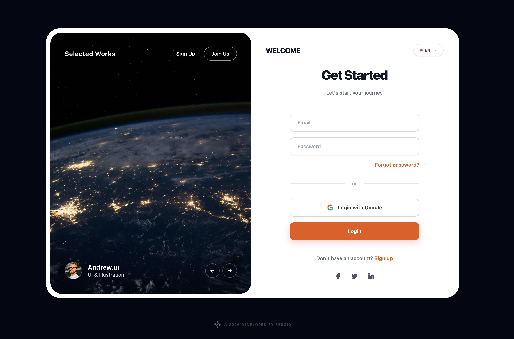

# Global Access Login | Pixel-Perfect UI 🚀



A modern, minimalist authentication interface designed with a **pixel-perfect** approach. This project focuses on delivering a seamless user experience combined with a premium aesthetic from the very first interaction.

[**Live Demo**](https://global-access-login.vercel.app/)

---

### 🛠 Technical Stack


---

### ✨ Key Features

*   **Pixel-Perfect Design:** Meticulous attention to spacing, visual hierarchy, and large rounded corners (`2.5rem`) for a premium look and feel.
*   **Dual-Column Layout:** Features a dynamic visual side inspired by creative portfolios and a clean, high-conversion form area.
*   **Fully Responsive:** Completely adaptable across all devices, ensuring an optimal experience from mobile to desktop.
*   **Smooth Micro-interactions:** Sophisticated hover effects and fluid transitions integrated into all interactive elements and buttons.
*   **Social Auth Ready:** Custom-styled "Login with Google" button with optimized SVG integration.
*   **Intuitive Navigation:** Tab systems and selectors implemented using dynamic utility classes.
*   **Professional Signature:** Absolute-positioned footer with dynamic hover states and custom branding.

---

### 💻 Technical Deep Dive

- **Framework:** **Tailwind CSS** via CDN for rapid styling and lightweight implementation without heavy build steps.
- **Iconography:** **Lucide Icons** integration for modern, lightweight, and scalable vector symbols.
- **Typography:** Built with the **Inter** typeface to maximize readability and maintain a clean visual order.
- **Visual Assets:** Dynamic image curation powered by the **Unsplash API**.

---

### 🚀 How to Run

This project is built to be lightweight and doesn't require complex servers or pre-processors.

1.  **Clone the repository:**
    ```bash
    git clone https://github.com/sergiocode91/global-access-login.git
    ```
2.  **Open the file:**
    Simply drag and drop `index.html` into your preferred browser or use the *Live Server* extension in VS Code.

---

### ✒️ Author

Developed with ❤️ by **[Sergio](https://sergiocode.dev/)**.

---

*If you find this project useful, feel free to give it a ⭐️ on GitHub!*
